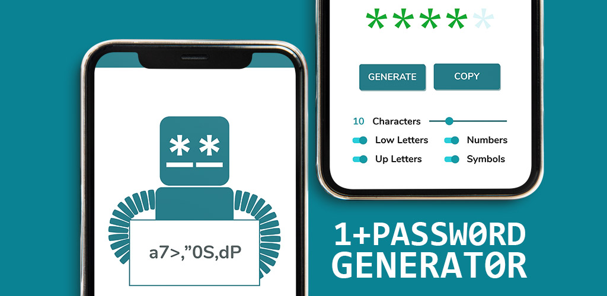

# 1+Password
> Play Store [_Link_](https://play.google.com/store/apps/details?id=com.mvqdev.onemorepassword)  
> Cool looking Android Mobile App that creates a random password based on editable settings that evaluate its strength and complexity.

## Table of Contents
* [General Info](#general-information)
* [Technologies Used](#technologies-used)
* [Features](#features)
* [Screenshots](#screenshots)
* [Project Status](#project-status)
* [Contact](#contact)
* [License](#license)

## General Information
This was my first project with which I learnt how to code and managed to publish my own app in under four months.
I wanted to prove myself two things: if I could code and if I liked to code. I could and I liked it!

## Technologies Used
- Kotlin
- Android Studio

## Features
- Generates Random Password.
- Control password strength and complexity by editing number of characters, add low or Up letters, numbers and symbols.
- Visual rating of password strength.

## Screenshots

## Project Status
Project is: Published in Play Store

## Contact
- mvqdev@gmail.com
- https://github.com/mvquinta
- https://twitter.com/mvqdev1

## License
This project is open source and available under the [MIT License](https://github.com/mvquinta/1-pomodoro/blob/main/LICENSE.md).

